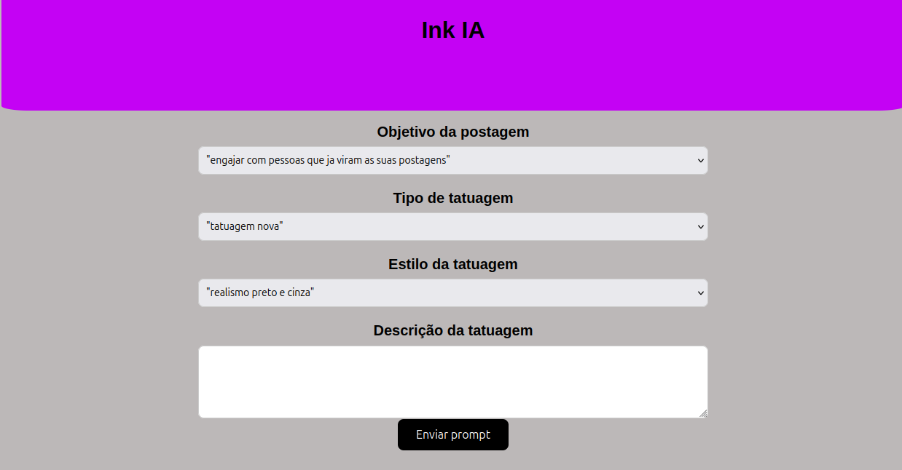
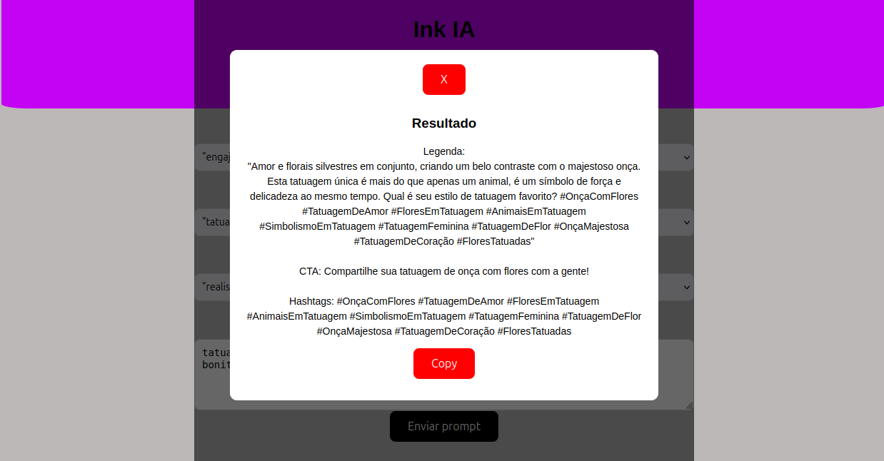

# 🧠 Ink IA – Tattoo Caption Generator

AI-powered tool that generates engaging Instagram captions for tattoo artists based on their tattoo description, style, and goal.

---

## 🚀 Live Demo

👉 https://zingy-pixie-9fb3b5.netlify.app/

---

## 📸 Screenshots

---

## ✨ Features

- Generate Instagram captions using AI
- Customize based on:
  - Tattoo style
  - Tattoo type
  - Marketing goal
- Clean and simple UI
- One-click copy to clipboard
- Fast response with AI integration

---

## 🎯 Use Case

This tool helps tattoo artists quickly create high-quality Instagram captions, saving time and improving engagement with their audience.

---

## 🛠️ Tech Stack

- Frontend: HTML, CSS, JavaScript
- Backend: Node.js (API)
- AI Model: LLaMA 3
- Deployment: Netlify (Frontend), Render (API)

---

## 🏗️ Project Structure
